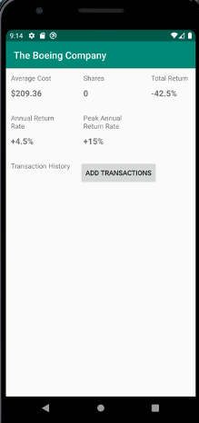
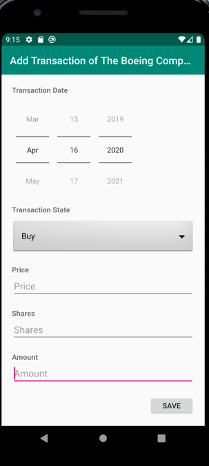

==================
About Smart Invest
==================

The functions of Smart Invest includs:

#. Developing a mobile invest app, together with test apps

#. Store stock transaction records, and calculate the returns automatically. 

#. Send alarms to the owner when the stock price hit the preset constrain. 

Main Layout
-----------

The main layout of the Smart Invest app is as follows:

.. image:: figures/mainLayout.png

One Fund Detail Layout
----------------------

The details of one fund are presented as :

And the add/modify transaction interface is designed as:

